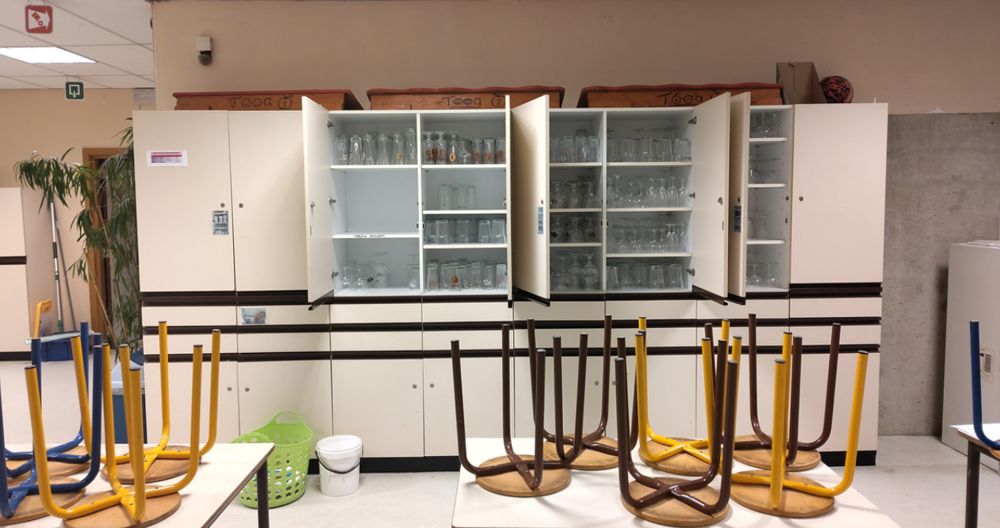
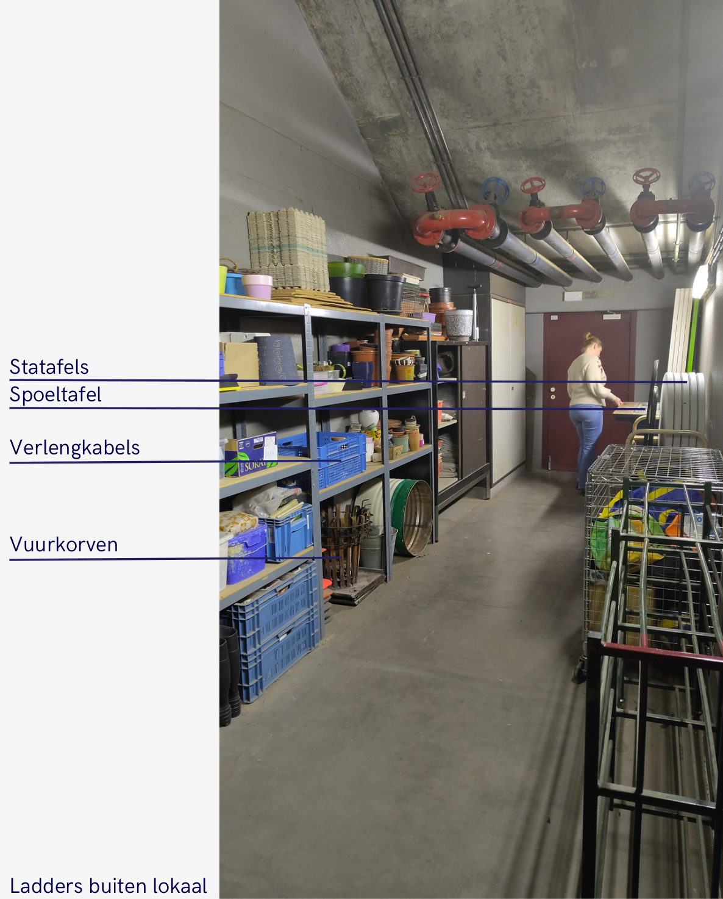

# Dag van de activiteit

## Taken

* Tafels/toog opbouwen. Hou op voorhand rekening met het weer (zie opstelling bar bij café binnen of bij café buiten verderop)
* Prijslijsten ophangen
* Klaarzetten bij de bar:
  * Bakken voor leeggoed
  * Afvalbakken (glas, PMD, papier, rest)
  * Afwasmanden (die in de vaatwas gaan)
* Klaarzetten op koer (indien buiten):
  * Afruimplek voor ouders en kinderen #TODO: verduidelijken
* Muziek klaarzetten #TODO: Hoe?

## Wat vind je waar?

| Wat                            | Waar                                     | Opmerkingen  |
| ------------------------------ | ---------------------------------------- | ------------ |
| Glazen                         | Kast restaurantje                        |              |
| Toogplanken                    | Boven op de kasten (restaurantje)        |              |
| Prijslijsten + plakband        | Kast restaurantje bovenste schuif rechts |              |
| Kurkentrekkers + schrijfgerief | Kast restaurantje bovenste schuif rechts |              |
| Dienbladen                     | Keuken                                   | #TODO: Waar? |
| Plastic bekers                 | Keuken, kast naast vaatwasmachine        |              |
| Servies en bestek              | Keuken, kast naast vaatwasmachine        |              |
| Voorraad drank                 | Kelder via keuken                        |              |
| Statafels                      | Kelder via bruine zaal                   |              |
| Spoeltafels                    | Kelder via bruine zaal                   |              |
| Verlengkabels                  | Kelder via bruine zaal                   |              |
| Vuurkorven                     | Kelder via bruine zaal                   |              |
| Ladders                        | Onderaan trap vanuit bruine zaal         |              |
| Handdoeken                     | Restaurantje                             | #TODO: Waar? |
| Verdeeldozen                   |                                          | #TODO: Waar? |

* #TODO: invoegen foto met nummers/markeringen

## Opstelling bij bar buiten

* #TODO: invoegen fotos

## Opstelling bij bar binnen

* Maak foto's van de opstelling van de tafels in het restaurantje

* #TODO: invoegen fotos
