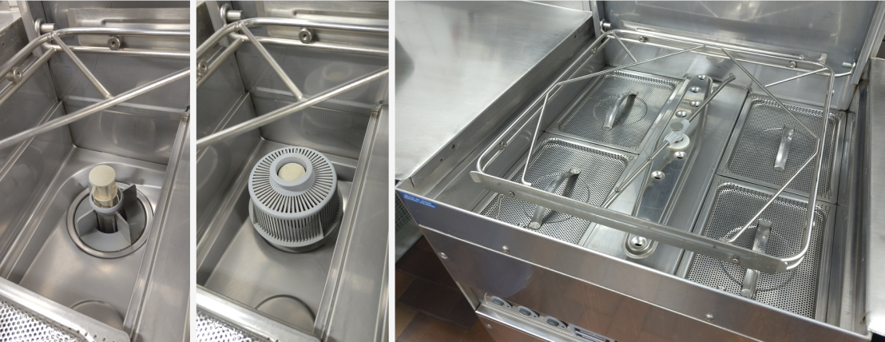

# Gebruik afwasmachine

## Opstarten

* Steek de filter/stop in
* Leg de 4 roosters in de machine
* Giet een half bekertje product (staat naast machine) op de roosters
* Sluit de machine (!)
* Zet de rode knop tegen muur op 1
* Druk op de 1e groene knop. Machine draait nu en het water warmt op.

## Gebruik

* Vuile vaat op voorhand afsproeien (handsproeier rechts van de vaatwasser)
* Mand in machine schuiven
* Machine sluiten, start automatisch
* Pas wanneer het lichtje van tweede knop uit is, mag de machine open

## Afsluiten

* Zet de rode knop tegen de muur op 0
* Kantel het frame naar omhoog en neem de roosters en filter/stop uit de machine. Laat de machine leeglopen en verwijder eventueel vuil.
* Spoel de losse stukken (roosters en filter) af en leg ze terug zodat alles kan drogen.

* #TODO foto's toevoegen
