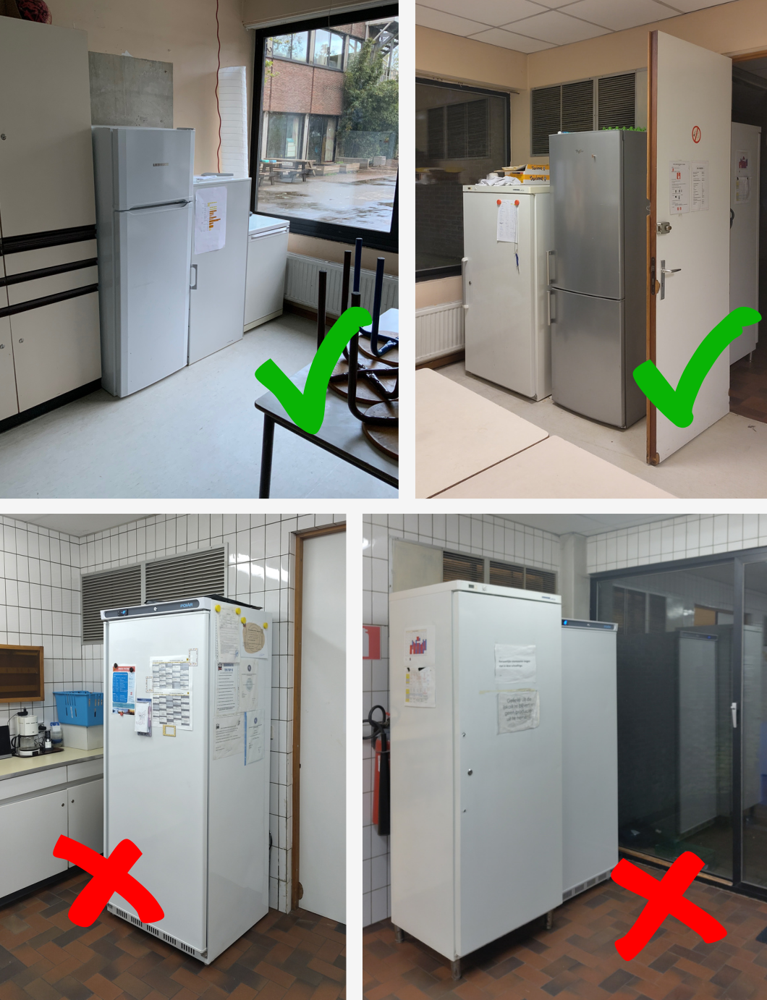
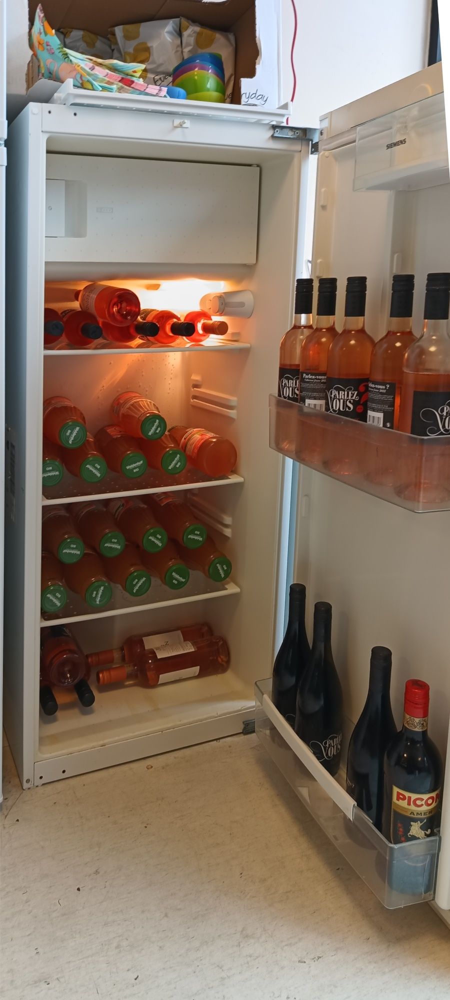
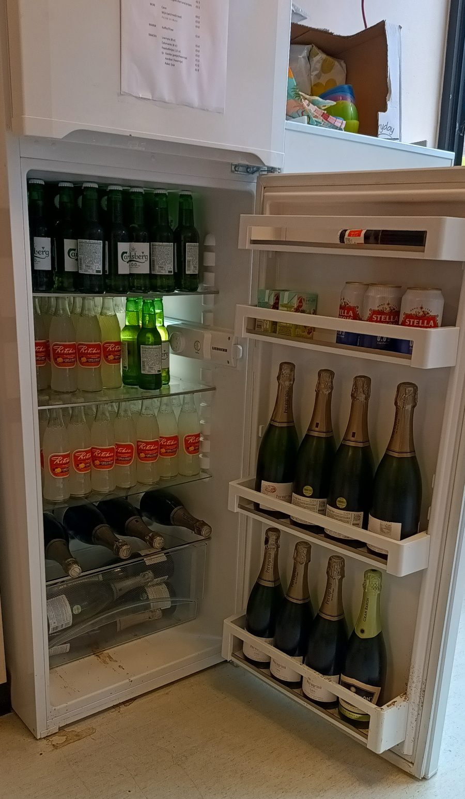

# Dag voor de activiteit

* Kassa/drankkaarten ophalen bij Ilse
* Drank koud zetten:
  * Voorraad drank staat in de kelder via trap keuken en is op voorhand geteld
  * Let op: niet alle ijskasten mogen gebruikt worden (zie verder)

## Drank klaarzetten

Drankverbruik wisselt veel, maar gemiddeld komen we ergens uit bij volgende hoeveelheden:

| Wat?               | Hoeveel |
| ------------------ | :-----: |
| Cola 20cl          |   20    |
| Cola zero 20cl     |   20    |
| Appelaere appelsap |   60    |
| Ritchie wit        |   25    |
| Ritchie geel       |   30    |
| Ritchie roze       |   40    |
| Eaulala spuitwater |   10    |
| Omer               |   15    |
| Stella             |   35    |
| Carlsberg 0.0      |   15    |
| Stroom S&S         |   15    |
| Stroom Supreme     |    5    |
| Witte wijn (fles)  |    3    |
| Rosé wijn (fles)   |    2    |
| Rode wijn(fles)    |    2    |
| Cava (fles)        |    4    |

## Welke koelkasten + hoe stapelen

