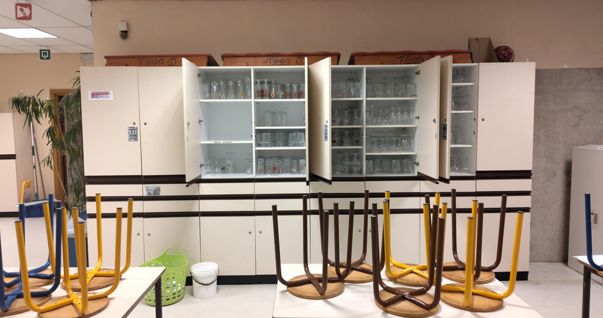
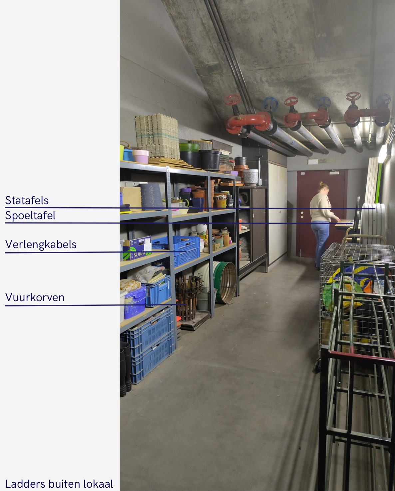
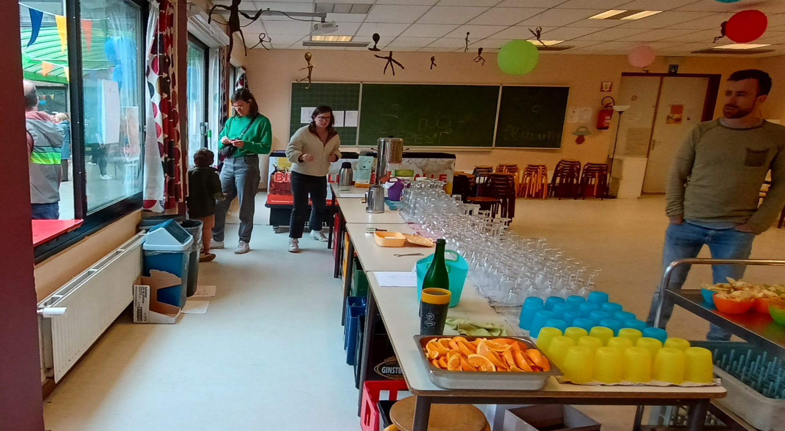

# Dag van de activiteit

## Taken

* Tafels/toog opbouwen. Hou op voorhand rekening met het weer (zie opstelling bar bij café binnen of bij café buiten verderop)
* Prijslijsten ophangen
* Klaarzetten bij de bar:
  * Bakken voor leeggoed
  * Afvalbakken voor glas, PMD, papier en rest. Label deze zodat iedereen dezelfde verdeling gebruikt.
  * Afwasmanden van de vaatwasser zodat afwas gemakkelijk verzameld kan worden.
* Klaarzetten op koer (indien buiten):
  * Afruimplek (lege mand voor in de vaatwasser en een glasbak voor Richie)
* Muziek klaarzetten * [ ] #TODO: Hoe?

## Wat vind je waar?

| Wat                            | Waar                                                      | Opmerkingen                                       |
| ------------------------------ | --------------------------------------------------------- | ------------------------------------------------- |
| Glazen                         | Kast restaurantje                                         |                                                   |
| Toogplanken                    | Boven op de kasten (restaurantje)                         |                                                   |
| Prijslijsten + plakband        | Kast restaurantje bovenste schuif rechts                  |                                                   |
| Kurkentrekkers + schrijfgerief | Kast restaurantje bovenste schuif rechts                  |                                                   |
| Dienbladen                     | Keuken                                                    | #TODO: Waar?                                      |
| Schotelvodden                  | Restaurantje, kastjes naast de keuken                     | Na gebruik op het droogrekje in de keuken hangen. |
| Plastic bekers                 | Keuken, kast naast vaatwasmachine                         |                                                   |
| Servies en bestek              | Keuken, kast naast vaatwasmachine                         |                                                   |
| Voorraad drank                 | Kelder via keuken, code via Bjorn of verantwoordelijke OC |                                                   |
| Statafels                      | Kelder via bruine zaal                                    |                                                   |
| Spoeltafels                    | Kelder via bruine zaal                                    |                                                   |
| Verlengkabels                  | Kelder via bruine zaal                                    |                                                   |
| Vuurkorven                     | Kelder via bruine zaal                                    |                                                   |
| Ladders                        | Onderaan trap vanuit bruine zaal                          |                                                   |
| Handdoeken                     | Restaurantje                                              | #TODO: Waar?                                      |
| Verdeeldozen                   |                                                           | #TODO: Waar?                                      |
| Borstel/vuilblik               | In de gang naar het restaurantje, achter de deur          | #TODO: waar?                                      |
| Dweil                          |                                                           | #TODO: waar?                                      |

* #TODO: invoegen foto met nummers/markeringen

## Opstelling van de bar

* Maak foto's van de opstelling van de tafels in het restaurantje zodat je die achteraf op dezelfde manier kan terugzetten.

* #TODO: invoegen fotos bar indien binnen
